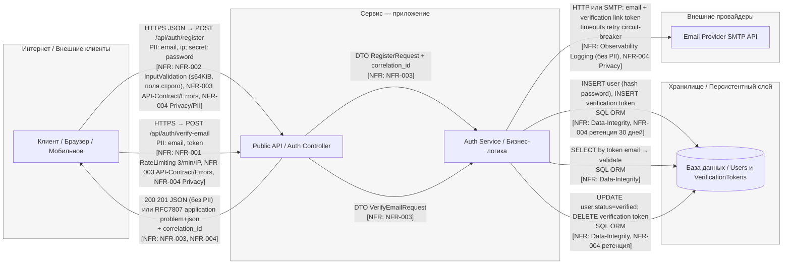
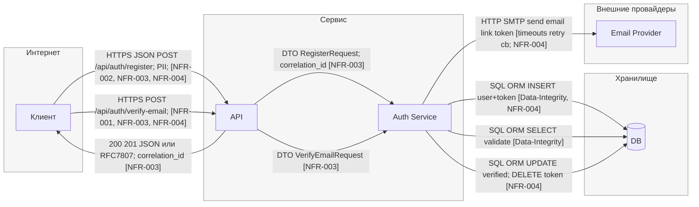

## DFD

## STRIDE

| Element                                  | Data/Boundary                         | Threat (S/T/R/I/D/E) | Description                                                                     | NFR link (ID)                                 | Mitigation idea (ADR later)                          |
| ---------------------------------------- | ------------------------------------- | -------------------: | ------------------------------------------------------------------------------- | --------------------------------------------- | ---------------------------------------------------- |
| **Boundary: Internet ↔ Service**         | TLS, public                           |                    S | Подмена сервера/клиента при неверной TLS-конфигурации (downgrade/invalid cert). | need NFR: Security-TLS                        | Enforce TLS1.2+, HSTS, cert pinning (mobile)         |
| Boundary: Internet ↔ Service             | TLS, public                           |                    I | Утечка данных при отключенном/слабом TLS.                                       | need NFR: Security-TLS                        | TLS hardening baseline                               |
| **Edge: Internet → API (/register)**     | HTTPS JSON, PII (email, ip), password |                    T | Подделка/засорение тела: лишние поля, превышение размера, некорректные типы.    | **NFR-002**                                   | Strict DTO schema, max body 64KiB, 400/413           |
| Edge: Internet → API (/register)         | HTTPS JSON, public                    |                    D | DoS большим числом запросов/большими телами на /register.                       | **NFR-002**, **need NFR: RateLimit-register** | Body size limit + global rate limit /register        |
| Edge: Internet → API (/register)         | API errors                            |                    I | Подробные ошибки раскрывают внутренности (stack traces, схемы).                 | **NFR-003**                                   | RFC7807, без стэктрейсов, correlation_id             |
| **Edge: Internet → API (/verify-email)** | HTTPS JSON, PII (email), token        |                    S | Брутфорс/повтор токена подтверждения (replay/guess).                            | need NFR: Token-Entropy/TTL                   | High-entropy token, short TTL, bind to email+purpose |
| Edge: Internet → API (/verify-email)     | public endpoint                       |                    D | Злоупотребление эндпоинтом (флуд) для истощения ресурса.                        | **NFR-001**                                   | 3/min/IP + 429 Retry-After                           |
| Edge: Internet → API (/verify-email)     | API errors                            |                    I | Ошибки выдают, существует ли email (email enumeration).                         | **NFR-003**, **NFR-004**                      | Универсальные ответы для существ/не существ, RFC7807 |
| **Node: API (Controller/Gateway)**       | Request headers, IP                   |                    T | Доверие к `X-Forwarded-For`/proxy без белого списка — обход rate limit.         | need NFR: Trusted-Proxies                     | Trust proxy chain, real IP from gateway only         |
| Node: API                                | Logging/metrics                       |                    R | Отсутствие трассировки запроса затрудняет разбор инцидентов.                    | **NFR-003**                                   | Correlation_id в контексте и логах                   |
| Node: API                                | Logging/PII                           |                    I | Логирование сырых PII (email, ip, token).                                       | **NFR-004**                                   | Маскирование/редакция PII в логах                    |
| **Edge: API → Service**                  | DTO Register/Verify                   |                    T | Обход бизнес-валидации при неполной проверке схемы/статуса.                     | **NFR-002**                                   | Central DTO validation + state checks                |
| Edge: API → Service                      | Internal call                         |                    R | Нет аудита кто/что инициировал изменение статуса пользователя.                  | need NFR: Auditability                        | Audit event “user_verified” с актором и временем     |
| **Node: Service (Auth Service)**         | Business logic                        |                    S | Прямой доступ к команде “verify” без проверки токена (внутренний обход).        | need NFR: Internal-AuthZ                      | AuthZ на внутренние команды/ручки                    |
| Node: Service                            | State machine                         |                    T | Неверные переходы состояния (повторная верификация, гонки).                     | need NFR: Idempotency/State                   | Idempotency key, проверка текущего статуса           |
| Node: Service                            | Audit/Logs                            |                    R | Нет аудита генерации/погашения токенов.                                         | need NFR: Auditability                        | Audit trail для create/use/revoke token              |
| Node: Service                            | Errors/PII                            |                    I | Ошибки сервиса включают PII/секреты (например, части токена).                   | **NFR-003**, **NFR-004**                      | Problem+json без секретов, redaction hooks           |
| Node: Service                            | Resources                             |                    D | Неосвобождение ресурсов при внешних зависаниях → thread pool exhaustion.        | need NFR: Timeouts/CB                         | Global timeouts, circuit breaker, bulkhead           |
| **Edge: Service ↔ DB**                   | SQL/ORM                               |                    T | SQLi/манипуляция запросами при слабой параметризации.                           | **NFR-002**, need NFR: ORM-Params             | Parameterized queries, ORM safe API                  |
| Edge: Service ↔ DB                       | SQL/ORM                               |                    R | Нет следов кто и когда изменил запись пользователя.                             | need NFR: DB-Audit                            | DB audit (trigger/CDC) для критичных таблиц          |
| Edge: Service ↔ DB                       | Users, Tokens                         |                    I | Избыточный доступ/`SELECT *` → утечка лишних колонок PII.                       | **NFR-004**, need NFR: Least-Privilege        | Узкие SELECT/проекции, разделение прав               |
| Edge: Service ↔ DB                       | Connections                           |                    D | Долгие транзакции/блокировки приводят к истощению пула.                         | need NFR: DB-Timeouts                         | Tx timeout, query timeout, индексирование            |
| **Node: DB (Users, VerificationTokens)** | Data at rest (PII)                    |                    I | PII хранится без шифрования/ретенции.                                           | **NFR-004**                                   | Retention 30d для неподтв., encryption-at-rest       |
| Node: DB                                 | Token storage                         |                    S | Токены хранятся в открытом виде и могут быть выкрадены.                         | need NFR: Token-Storage                       | Хэширование токенов (HMAC/sha256) + соль             |
| **Edge: Service → External (Email)**     | SMTP/HTTP payload                     |                    I | Лишние PII в письме/запросе провайдеру.                                         | **NFR-004**                                   | Минимизация payload, DPA с провайдером               |
| Edge: Service → External (Email)         | Network call                          |                    D | Залипание без timeout/retry/circuit breaker.                                    | need NFR: Timeouts/Retry/CB                   | Timeout≤2s, retry≤3 с джиттером, CB                  |
| Edge: Service → External (Email)         | Observability                         |                    R | Нет наблюдаемости: неясно, ушло ли письмо, нет кореляции.                       | need NFR: Observability                       | Outbound span + delivery status metrics              |
| **Edge: API → Client (responses)**       | JSON/RFC7807                          |                    I | Возврат детальной причины (например, “email exists”) раскрывает состояние.      | **NFR-003**, **NFR-004**                      | Нейтральные сообщения, одинаковые статусы            |
| Edge: API → Client (responses)           | Public                                |                    S | Подмена ответа в кеше/по пути при неверных cache headers.                       | need NFR: Caching-Security                    | `Cache-Control: no-store` для чувствительных ответов |
| **Boundary: Service ↔ External**         | Trust boundary                        |                    E | Злоумышленник управляет внешним SMTP и влияет на бизнес-потоки.                 | need NFR: Outbound-Policies                   | Allow-list доменов, egress policies, DNS pinning     |
| Boundary: Service ↔ Storage              | Trust boundary                        |                    E | Завышенные права сервисного аккаунта к БД (DDL/DML все права).                  | need NFR: DB-Least-Privilege                  | Principle of least privilege, отдельные роли RW      |

## Шаблон приоритизации рисков L×I

### Таблица приоритизации (консолидация)

| Risk ID  | Source (DFD/Row)                                   | Consolidated Description                                                                                                      | Threat | NFR link (ID)                                          |     L | Rationale-L                                                        |     I | Rationale-I                                              |  Score | Decision  | ADR candidate                                                       |
| -------- | -------------------------------------------------- | ----------------------------------------------------------------------------------------------------------------------------- | ------ | ------------------------------------------------------ | ----: | ------------------------------------------------------------------ | ----: | -------------------------------------------------------- | -----: | --------- | ------------------------------------------------------------------- |
| **R-01** | Internet→API (/verify-email, /register)            | **Abuse/DoS публичных auth-эндпоинтов**: флад запросами и большими телами истощает ресурсы и мешает легитимным пользователям. | D      | **NFR-001**, **NFR-002**, need NFR: RateLimit-register | **4** | Публичная поверхность, легко автоматизируется; классическая атака. | **4** | Недоступность регистрации/верификации = простой сервиса. | **16** | **Top-5** | Global & per-route rate-limits + body-size limits                   |
| **R-02** | Service→External (Email)                           | **Зависание на внешнем почтовом провайдере**: отсутствие timeout/retry/CB вызывает pool exhaustion и цепной отказ.            | D      | need NFR: Timeouts/Retry/CB                            | **4** | Внешние вызовы нестабильны; без таймаутов сбоит часто.             | **4** | Degradation всего сервиса (регистрация “встаёт”).        | **16** | **Top-5** | Outbound resiliency (timeouts≤2s, retry≤3, jitter, circuit-breaker) |
| **R-03** | API/Service Logs & Errors, API→Client              | **Утечка PII через логи и ответы**: подробные ошибки/логи раскрывают email/token; возможна email-enum.                        | I      | **NFR-003**, **NFR-004**                               | **4** | Ошибки/логи генерятся часто; дефолтные конфиги болтливы.           | **4** | Массовая утечка PII/идентификаторов, комплаенс-риски.    | **16** | **Top-5** | PII masking + neutral RFC7807 (no stack), anti-enumeration          |
| **R-04** | Tokens in Service↔DB, Internet→API (/verify-email) | **Слабость verification-токенов**: низкая энтропия/долгий TTL/хранение в открытом виде → угадывание/кража и takeover.         | S/T/E  | need NFR: Token-Entropy/TTL, need NFR: Token-Storage   | **3** | Требует просчёта/утечки, но типовая ошибка в проектах.             | **4** | Компрометация учёток и подтверждений для многих юзеров.  | **12** | **Top-5** | Token hardening (128-bit entropy, short TTL, bind, hashed-at-rest)  |
| **R-05** | API→Service, DTO validation                        | **Недостаточная валидация и контракт**: лишние поля/невалидные состояния обходят бизнес-правила.                              | T      | **NFR-002**, **NFR-003**                               | **3** | Часто всплывает при эволюции DTO/версий.                           | **3** | Ошибки состояний/грязные данные; локальный ущерб.        |  **9** |           | Strict schema+reject unknown, state checks, idempotency             |
| **R-06** | Service↔DB (queries)                               | **Инъекции/манипуляции запросами** при слабой параметризации/конкатенации.                                                    | T      | **NFR-002**, need NFR: ORM-Params                      | **2** | ORM снижает риск, но ручные запросы встречаются.                   | **5** | Потеря/утечка данных, RCE в худшем случае.               | **10** |           | Parameterized queries only, lint/scan for raw SQL                   |
| **R-07** | DB (Users, VerificationTokens)                     | **Избыточные права и отсутствие аудита в БД**: сервисный аккаунт “всё может”, нет трассировки изменений.                      | E/R    | need NFR: DB-Least-Privilege, need NFR: DB-Audit       | **2** | Точка входа нужна; встречается из-за “удобства”.                   | **5** | Массовые изменения/удаления без следа.                   | **10** |           | Least-privilege roles + audit/CDC for critical tables               |
| **R-08** | Internet↔Service (TLS)                             | **Слабый TLS**: downgrade/MITM → перехват данных или подмена.                                                                 | S/I    | need NFR: Security-TLS                                 | **2** | Современные стеки ок по умолчанию; риск при мисконфиге.            | **4** | Утечка PII/кредов, компрометация сессий.                 |  **8** |           | TLS hardening baseline + HSTS, pinning (mobile)                     |
| **R-09** | API (rate-limit & IP)                              | **Обход rate-limit через некорректные доверенные прокси/заголовки**.                                                          | E/D    | need NFR: Trusted-Proxies                              | **3** | Частая мисконфигурация XFF/CF-Connecting-IP.                       | **3** | Локальный DoS/abuse на одном эндпоинте.                  |  **9** |           | Trusted proxy chain, real-IP from gateway only                      |
| **R-10** | API→Client (responses)                             | **Кэширование чувствительных ответов** (no-store отсутствует) → подмена/утечка через shared cache.                            | I/S    | need NFR: Caching-Security                             | **2** | Нужна специфичная инфраструктура/кэш-прослойка.                    | **3** | Раскрытие статусов/PII для подмножества юзеров.          |  **6** |           | `Cache-Control: no-store` for auth flows                            |
| **R-11** | Service→External (Email) Observability             | **Нет наблюдаемости отправок**: невозможно доказать доставку/откатить шторма ретраев.                                         | R/D    | need NFR: Observability                                | **3** | Часто забывают про метрики/трейсы.                                 | **2** | Дольше восстанавливаемся, но без прямой утечки.          |  **6** |           | Outbound spans + delivery metrics/alerts                            |
| **R-12** | Service↔DB (performance)                           | **Долгие транзакции/блокировки** → исчерпание пула соединений.                                                                | D      | need NFR: DB-Timeouts                                  | **3** | Нагрузочные пики/неиндексированные запросы.                        | **3** | Замедление/частичная недоступность.                      |  **9** |           | Tx/query timeouts, indexes, connection pool guards                  |

#### Примечания к консолидации

* Объединил все “PII в логах/ошибках + email enumeration” в **R-03** (единый контроль: RFC7807 + маскирование + нейтральные сообщения).
* Все внешние зависания/ретраи/CB сведены в **R-02**.
* Все вопросы токенов (энтропия, TTL, хранение, биндинг к email/цели) — **R-04**.
* DoS на /register (большие тела) и флуд на /verify-email склеены в **R-01** (пер-роут лимиты + лимиты размера).

---

## Сводка Top-5 (итог для S05)

* **Top-1: R-01 — Abuse/DoS публичных auth-эндпоинтов.**
  **Почему:** публичная поверхность, простая автоматизация → L=4; блокирует ключевой путь онбординга → I=4.
  **ADR:** Global & per-route rate-limits + body-size limits.

* **Top-2: R-02 — Зависание на внешнем почтовом провайдере.**
  **Почему:** внешняя зависимость, без таймаутов приводит к pool exhaustion → L=4, I=4.
  **ADR:** Outbound resiliency (timeouts/retry/jitter/circuit-breaker).

* **Top-3: R-03 — PII-утечки через логи/ошибки и email-enumeration.**
  **Почему:** часто встречается и масштабируемо (массовые логи) → L=4; приватность/комплаенс-удар → I=4.
  **ADR:** PII masking + neutral RFC7807 + анти-enumeration.

* **Top-4: R-04 — Слабость verification-токенов.**
  **Почему:** при плохой энтропии/хранении → takeover множества учёток; эксплуатация требует условий → L=3, I=4.
  **ADR:** Token hardening (128-bit entropy, short TTL, bind, hash-at-rest).

* **Top-5: R-06 — Инъекции/манипуляции запросами (SQLi и пр.).**
  **Почему:** ORM снижает вероятность → L=2, но ущерб критичен → I=5; по Score=10 выигрывает по тай-брейкерам (blast-radius/comp).
  **ADR:** Parameterized queries only, linters/scanners, запрет raw SQL.

---

---